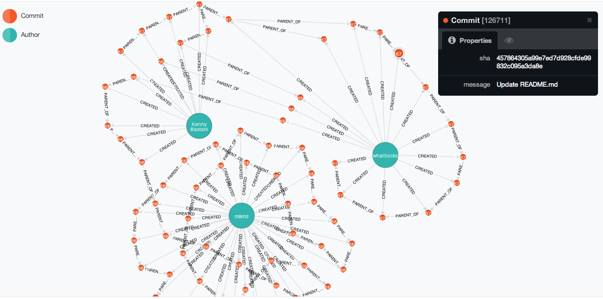

nit
===

git log --neo (not really, I couldn't sleep so I made this.

place the sh file in a git repo, make sure your local db is turned on, and press `sh make_cyp.sh`.

That'll create some Neo4j .cyp that will pump your git commit and author logs into your local db via the neo4j-shell. 

Make sure to edit the .sh file to point to your appropriate whosiwhatsits:

```
PATH_TO_CSV=$(dirname $(greadlink -f '$0'))
NEO_DB=your/path/to/neo
```
)

mapping git commits and authors into a neo4j db



This is a picture of one of my other repos. Three contributors, relatively few commits.

